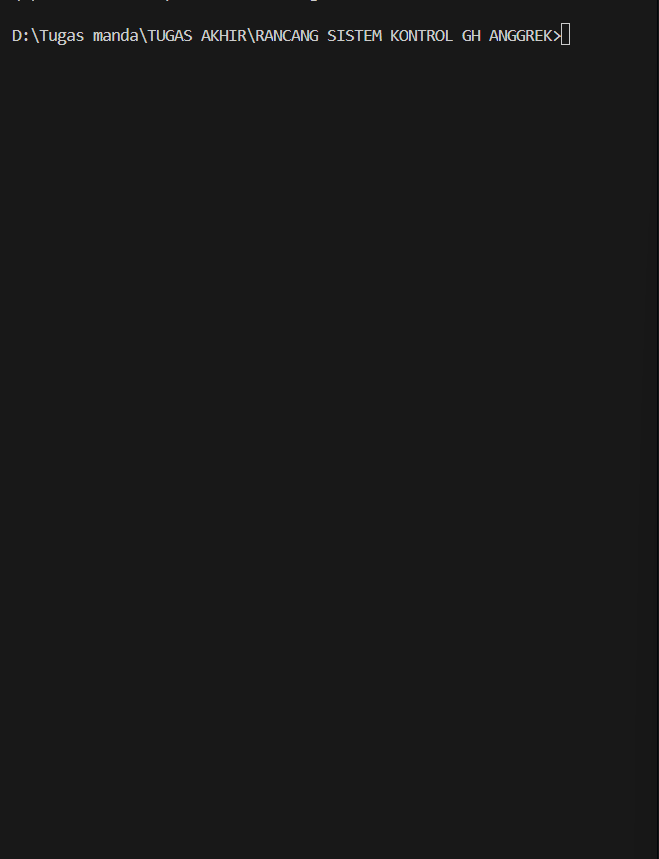

# 🌫️ Sistem Kontrol Kabut Otomatis untuk Greenhouse Anggrek (Rancangan Proyek)

Repositori ini berisi rancangan, arsitektur, dan analisis untuk proposal Tugas Akhir berjudul **"Rancang Bangun Sistem Kontrol Kabut Otomatis pada Greenhouse Anggrek Berbasis Artificial Intelligence dan Internet of Things"**.

---

### ## ✨ Konsep dan Simulasi Sistem (Mockup)

Berikut adalah **gambaran** bagaimana sistem **direncanakan** akan bekerja saat diimplementasikan. Simulasi ini menunjukkan alur kerja dari deteksi kondisi "Berkabut" hingga aktivasi kipas, lalu kembali ke kondisi normal.

---

### ## 📜 Latar Belakang dan Tujuan

Proyek ini dirancang untuk mengatasi masalah visibilitas dan kelembaban ekstrem akibat kabut di _greenhouse_ anggrek. Dengan memanfaatkan model CNN pada Raspberry Pi, sistem ini bertujuan untuk menciptakan lingkungan tumbuh yang lebih stabil dan memastikan sistem monitoring visual dapat selalu diandalkan.

**➡️ Untuk analisis masalah dan tujuan yang lebih mendalam, silakan lihat [Dokumen Perancangan Lengkap](docs/analisis_dan_metode.md).**

---

### ## 🛠️ Rancangan Arsitektur

**Perangkat Keras yang Direncanakan:**

- **Processing Unit**: Raspberry Pi 4 Model B
- **Input Unit**: Raspberry Pi Camera Module 3
- **Control Unit**: Modul Relay 5V & Kipas Exhaust DC 12V

**Rancangan Alur Kerja Perangkat Lunak:**

1.  **Jadwal**: Sistem berjalan secara periodik.
2.  **Akuisisi**: Kamera menangkap citra _greenhouse_.
3.  **Prediksi**: Model AI mengklasifikasikan citra (`Berkabut`/`Tidak Berkabut`).
4.  **Aksi**: Jika `Berkabut > 80%`, kipas aktif selama durasi tertentu.
5.  **Monitoring**: Hasil dan status dikirim ke _cloud_.

---

### ## 🚀 Rencana Implementasi

Rencana implementasi proyek ini dapat dilihat pada struktur repositori di bawah. Kode sumber akhir akan ditempatkan di folder `src/` dan model AI di folder `models/`.
